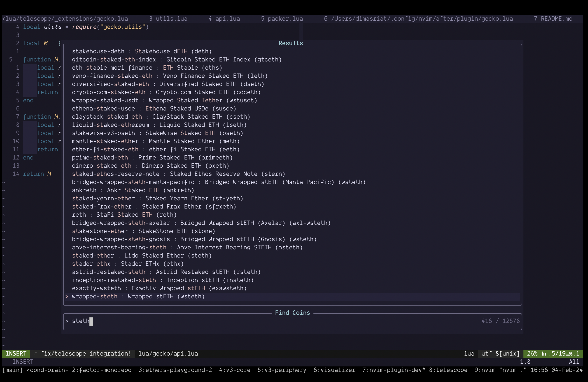

# gecko.nvim 🦎



`gecko.nvim` is a Neovim plugin that leverages the capabilities of both Plenary and Telescope to allow users to search for cryptocurrency details directly from CoinGecko. This plugin offers a seamless and efficient way for developers and cryptocurrency enthusiasts to stay updated with the latest coin information without leaving their editor.

## Purpose of This Plugin

- **Facilitating Developers with Token Address Lookup**: Easily find token addresses across different blockchains, making developers' work faster and more efficient.
- **Real-Time Crypto Market Insights**: Stay up-to-date with the latest cryptocurrency market trends and data in real-time.
- **Enhancing Understanding of Cryptocurrencies**: Get useful information about what different coins, tokens, and blockchains are used for.
- **Trusted Source for Crypto Info**: Directly access accurate and reliable information from CoinGecko, ensuring you have trusted details about any cryptocurrency.

## Features

- **Search Cryptocurrency**: Easily search for cryptocurrencies and get detailed information.
- **Telescope Integration**: Utilize Telescope's fuzzy finding to quickly locate the information you need.
- **Real-Time Data**: Fetch real-time data from CoinGecko.

## Prerequisites

- Neovim (0.5 or newer)
- [Telescope](https://github.com/nvim-telescope/telescope.nvim)
- [Plenary](https://github.com/nvim-lua/plenary.nvim)

## Installation

You can install `gecko.nvim` using your favorite package manager.

### With [Vim-Plug](https://github.com/junegunn/vim-plug)

```vim
Plug 'dimasriat/gecko.nvim'
```

### With [Packer](https://github.com/wbthomason/packer.nvim)

```lua
use {'dimasriat/gecko.nvim'}
```

## Usage

1. Open Neovim.
2. To use `gecko.nvim`, you can set up a keymap in your Neovim configuration. For example:

    ```lua
    local gecko = require("gecko")
    vim.keymap.set('n', '<leader>zg', gecko.find_coin, {})
    ```

3. Press `<leader>zg` in normal mode to invoke the plugin and start searching for cryptocurrencies.

## Contributing

Contributions are welcome! If you'd like to contribute, please fork the repository and use a feature branch. Pull requests are warmly welcome.

## Acknowledgements

- Thanks to the [Telescope](https://github.com/nvim-telescope/telescope.nvim) and [Plenary](https://github.com/nvim-lua/plenary.nvim) contributors.
- Cryptocurrency data provided by [CoinGecko](https://www.coingecko.com/).
