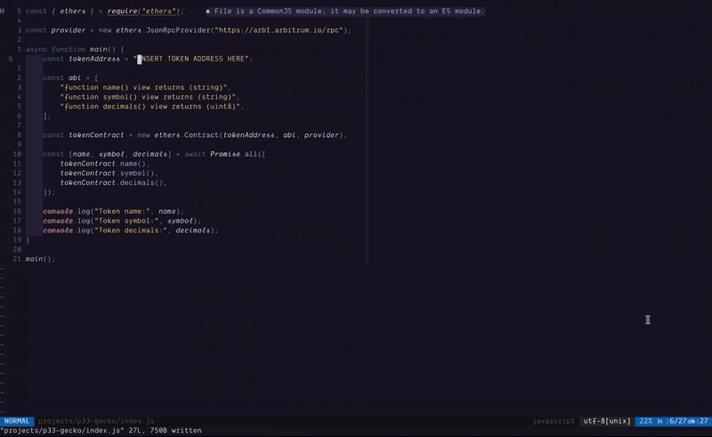

# gecko.nvim 🦎



<div align="center">
    
[](http://www.lua.org)
[](https://neovim.io)

</div>

`gecko.nvim` is a Neovim plugin that leverages the capabilities of both Plenary and Telescope to allow users to search for cryptocurrency details directly from CoinGecko. This plugin offers a seamless and efficient way for developers and cryptocurrency enthusiasts to stay updated with the latest coin information without leaving their editor.

## Purpose of This Plugin

- **Facilitating Developers with Token Address Lookup**: Easily find token addresses across different blockchains, making developers' work faster and more efficient.
- **Real-Time Crypto Market Insights**: Stay up-to-date with the latest cryptocurrency market trends and data in real-time.
- **Enhancing Understanding of Cryptocurrencies**: Get useful information about what different coins, tokens, and blockchains are used for.
- **Trusted Source for Crypto Info**: Directly access accurate and reliable information from CoinGecko, ensuring you have trusted details about any cryptocurrency.

## Features

- **Search Cryptocurrency**: Easily search for cryptocurrencies and get detailed information.
- **Telescope Integration**: Utilize Telescope's fuzzy finding to quickly locate the information you need.
- **Real-Time Data**: Fetch real-time data from CoinGecko.

## Prerequisites

- Neovim (0.5 or newer)
- [Telescope](https://github.com/nvim-telescope/telescope.nvim)
- [Plenary](https://github.com/nvim-lua/plenary.nvim)

## Installation

You can install `gecko.nvim` using your favorite package manager.

### With [Vim-Plug](https://github.com/junegunn/vim-plug)

```vim
Plug 'nvim-lua/plenary.nvim'
Plug 'nvim-telescope/telescope.nvim'
Plug 'dimasriat/gecko.nvim'
```

### With [Packer](https://github.com/wbthomason/packer.nvim)

```lua
use {
    'dimasriat/gecko.nvim',
    requires = {
        { 'nvim-lua/plenary.nvim' },
        { 'nvim-telescope/telescope.nvim' },
    }
}
```

## Usage

To start exploring cryptocurrency data directly within Neovim, you first need
to set up a keybinding for the `gecko:find_coin()`  function. This will allow
you to invoke the Gecko plugin and search for coin details with ease.

Here is a basic example of how to configure a keybinding:
```lua
local gecko = require("gecko")

-- Set up a keybinding to invoke the Gecko plugin
-- This binds the function to <leader>zg in normal mode
vim.keymap.set('n', '<leader>zg', function()
    gecko:find_coin()
end, {desc = "Invoke Gecko to find coin details"})
```
In this configuration, pressing `<leader>zg` in normal mode will activate the
`gecko:find_coin()` function, allowing you to search and display cryptocurrency
information right within your Neovim editor.

Ensure you replace `<leader>zg` with your preferred keybinding if necessary. The
`<leader>` key is a placeholder that can be defined in Neovim to be any key you
choose, making your custom shortcuts comfortable and intuitive to use.

## Contributing

Contributions are welcome! If you'd like to contribute, please fork the repository and use a feature branch. Pull requests are warmly welcome.

## Acknowledgements

- Thanks to the [Telescope](https://github.com/nvim-telescope/telescope.nvim) and [Plenary](https://github.com/nvim-lua/plenary.nvim) contributors.
- Cryptocurrency data provided by [CoinGecko](https://www.coingecko.com/).

